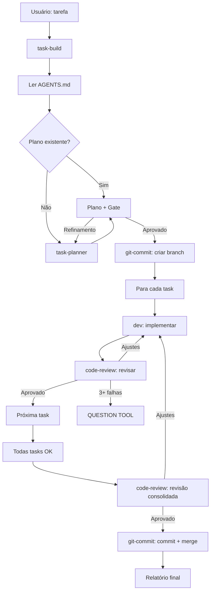

# Plano: Correções task-build.md + Coerência Multi-Arquivo (v2)

> **Data**: 2026-06-23
> **Revisão code-review aplicada**: 3 correções obrigatórias
> **Total**: 14 sub-tarefas em 4 arquivos

## Resumo

Atualizar task-build.md com 4 correções principais (Step 0, Step 3, Step 6e, Regra NUNCA editar) e sincronizar MULTI_AGENT_ORCHESTRATION.md, AGENTS.md e task-planner.md.

## Correções do Code-Review Aplicadas

1. ✅ Renumerar Change 10→11 (task-planner.md)
2. ✅ Fallback Step 0 (AGENTS.md não existe → logar WARN + continuar)
3. ✅ Handler pós-máximo-retries Step 6e (QUESTION TOOL após 3 tentativas consolidadas)
4. ✅ Mecanismo de detecção Step 3 (listar arquivos em `.opencode/plans/`)

---

## Sub-tarefa 1: Step 0 — Ler AGENTS.md

**Arquivo**: `.config/opencode/agents/task-build.md`
**Tipo**: Inserção
**Linha de referência**: Antes da linha 13 (Step 1)

**Texto exato**:

```markdown
### 0. Ler AGENTS.md (SEMPRE)

Antes de qualquer tarefa, **SEMPRE** ler `AGENTS.md` para entender:

- **Estrutura do projeto** (L6-52): onde ficam scripts, configs, docs
- **Arquitetura de Config** (L54-60): symlink `~/.config/opencode/`, paths relativos
- **Convenções e Gotchas** (L124-158): shebang, `--shared-tmp`, RBAC syntax, `0.0.0.0` crash, etc.
- **Leitura Recomendada por Tarefa** (L180-189): quais docs ler para cada tipo de tarefa
- **Agent Workflow** (L191-291): padrões de orquestração, regras de delegação

**Se AGENTS.md não existir ou falhar ao ler:**
- Logar: `[HH:MM] WARN: AGENTS.md não encontrado — seguindo convenções padrão`
- Continuar com step 1 (não interromper pipeline)

**Quando delegar para subagentes**, incluir no prompt:

- Se a tarefa envolve **scripts Termux/proot** → incluir gotchas relevantes
- Se a tarefa envolve **config do opencode** → incluir seção "Arquitetura de Config"
- Se a tarefa envolve **subagentes** → incluir seção "Agent Workflow"
- Se **não tem certeza** → instruir o subagent a ler AGENTS.md antes de começar
```

---

## Sub-tarefa 2: Atualizar Step 1

**Arquivo**: `.config/opencode/agents/task-build.md`
**Tipo**: Atualização
**Linha de referência**: Linha 13-15

**Texto exato**:

```markdown
### 1. Carregar skills obrigatórias + ler AGENTS.md

1. Ler `AGENTS.md` (conforme step 0)
2. Carregar skill: `executing-plans`
3. Carregar skills dinâmicas relevantes à tarefa
```

---

## Sub-tarefa 3: Atualizar prompt do task-planner (Step 4)

**Arquivo**: `.config/opencode/agents/task-build.md`
**Tipo**: Substituição
**Linha de referência**: Linha 32

**Texto exato**:

```markdown
Chamar o subagent `task-planner` via Task tool:
```
task(subagent_type="task-planner", description="Planejar tarefa", prompt="{tarefa do usuário}. IMPORTANTE: Ler AGENTS.md antes de planejar. Seguir convenções do projeto.")
```
```

---

## Sub-tarefa 4: Redesign Step 3

**Arquivo**: `.config/opencode/agents/task-build.md`
**Tipo**: Substituição
**Linha de referência**: Linhas 22-26

**Texto exato**:

```markdown
### 3. Verificar se já existe plano

1. Verificar se há plano em `.opencode/plans/` para esta tarefa:
   - Listar arquivos em `.opencode/plans/` (se diretório não existir ou estiver vazio → NÃO há plano)
2. Se **SIM** → usar **QUESTION TOOL**:
   - Header: `"Plano existente encontrado"`
   - Options:
     - `"Reutilizar plano existente (Recommended)"` → step 5 (apresentar ao usuário)
     - `"Criar novo plano"` → step 4
     - `"Sair"` → encerrar
3. Se **NÃO** → step 4 (planejar do zero)
```

---

## Sub-tarefa 5: Atualizar prompt do dev (Step 6a)

**Arquivo**: `.config/opencode/agents/task-build.md`
**Tipo**: Inserção adicional
**Linha de referência**: Após linha 98

**Texto exato** (adicionar ao prompt do dev):

```
**Prompt para dev**: Incluir instrução para marcar backlog com `date` e, se aplicável, ler AGENTS.md:
```
Após implementar, marcar a task como concluída no backlog:
1. Executar: `date '+%d/%m/%Y:%H:%M'`
2. Substituir `- [ ]` por `- [x]`
3. Adicionar ` – Concluído em [resultado do date]` ao final da linha
4. NUNCA digitar o timestamp manualmente

Se a tarefa envolver scripts Termux/proot, ler AGENTS.md seção "Convenções e Gotchas" antes de começar.
```
```

---

## Sub-tarefa 6: Atualizar prompt do code-review (Step 6b)

**Arquivo**: `.config/opencode/agents/task-build.md`
**Tipo**: Substituição
**Linha de referência**: Linha 105

**Texto exato**:

```
task(subagent_type="code-review", description="Revisar task {N}", prompt="{context from dev implementation}. IMPORTANTE: Ler AGENTS.md antes de revisar. Verificar conformidade com convenções do projeto.")
```

---

## Sub-tarefa 7: Adicionar Step 6e — Revisão final obrigatória

**Arquivo**: `.config/opencode/agents/task-build.md`
**Tipo**: Inserção
**Linha de referência**: Após linha 132 (step 6d), antes da linha 134 (step 7)

**Texto exato**:

```markdown
### 6e. Revisão final obrigatória

Após TODAS as tasks aprovadas pelo code-review individual, **ANTES** de delegar para git-commit:

1. Delegar para code-review uma revisão consolidada de **TODAS** as mudanças:
```
task(subagent_type="code-review", description="Revisão final consolidada", prompt="Revisar TODAS as mudanças implementadas nesta sessão. Verificar: coerência entre arquivos, qualidade geral, conformidade com o plano. Rodar quality checks finais. Ler AGENTS.md antes de revisar.")
```

2. Se veredito != "Aprovado":
   - **"Aprovação condicional"** → usar **QUESTION TOOL**:
     - Header: `"Revisão consolidada"`
     - Options:
       - `"Aceitar com ressalvas"` → step 7
       - `"Corrigir"` → volta para dev (conta como retry)
   - **"Precisa de ajustes"** → volta para dev (conta como retry)
   - Máximo **2 tentativas adicionais**

3. Após 2 tentativas adicionais com veredito != "Aprovado":
   - Usar **QUESTION TOOL**:
     - Header: `"Revisão consolidada não aprovada após 3 tentativas"`
     - Options:
       - `"Aceitar com ressalvas"` → step 7
       - `"Parar build"` → interrompe pipeline

4. LOG: `[HH:MM] code-review → revisão final → veredito`
```

---

## Sub-tarefa 8: Adicionar regra "NUNCA editar arquivos"

**Arquivo**: `.config/opencode/agents/task-build.md`
**Tipo**: Inserção
**Linha de referência**: Após linha 182 (seção Orquestração)

**Texto exato**:

```markdown
- NUNCA editar arquivos diretamente — todas as mudanças (incluindo documentação) são delegadas para `dev`
```

---

## Sub-tarefa 9: Atualizar diagrama Mermaid

**Arquivo**: `docs/MULTI_AGENT_ORCHESTRATION.md`
**Tipo**: Substituição
**Linha de referência**: Linhas 105-123

**Texto exato**:

```markdown

```

---

## Sub-tarefa 10: Atualizar Seção 2.1

**Arquivo**: `docs/MULTI_AGENT_ORCHESTRATION.md`
**Tipo**: Inserção
**Linha de referência**: Após linha 59 (seção "O que NÃO faz")

**Texto exato** (adicionar ao "O que faz"):

```markdown
- **SEMPRE lê AGENTS.md** antes de qualquer tarefa para entender convenções e gotchas
- **Guia subagentes** com contexto de AGENTS.md quando delega tarefas
```

---

## Sub-tarefa 11: Adicionar Gotcha 9.4

**Arquivo**: `docs/MULTI_AGENT_ORCHESTRATION.md`
**Tipo**: Inserção
**Linha de referência**: Após linha 590 (seção 9.3)

**Texto exato**:

```markdown
### 9.4 task-build nunca edita arquivos

task-build é um orquestrador puro. Mesmo para tarefas de documentação,
task-build delega a edição para `dev`. Se precisar modificar um arquivo
durante o pipeline, delegar: `task(subagent_type="dev", ...)`.
```

---

## Sub-tarefa 12: Atualizar pipeline em AGENTS.md

**Arquivo**: `AGENTS.md`
**Tipo**: Substituição
**Linha de referência**: Linhas 222-228

**Texto exato**:

```markdown
**Padrão completo** (feature ou fix complexo):
```
1. task-build → ler AGENTS.md + receber tarefa
2. task-planner → gerar plano adaptativo
3. dev → implementar
4. code-review → revisar qualidade (individual + consolidado)
5. git-commit → branch + commit + cleanup
```
```

---

## Sub-tarefa 13: Atualizar regras em AGENTS.md

**Arquivo**: `AGENTS.md`
**Tipo**: Inserção + Atualização
**Linha de referência**: Linhas 255-271

**Texto exato** (atualizar loop de trabalho):

```markdown
### Loop de trabalho

```
┌─────────────────────────────────────────────────┐
│  0. Ler AGENTS.md                               │
│     └─ entender convenções e gotchas             │
│  1. Entender tarefa                              │
│     └─ explore ou ler contexto                   │
│  2. Planejar (se complexo)                       │
│     └─ task-planner agent                        │
│  3. Implementar                                  │
│     └─ dev agent                                 │
│  4. Verificar                                    │
│     └─ code-review (individual por task)         │
│  5. Revisão consolidada                          │
│     └─ code-review (todas as tasks)              │
│  6. Commitar + Push                              │
│     └─ git-commit agent                          │
└─────────────────────────────────────────────────┘

Ou usar o agente `task-build` para orquestrar tudo automaticamente.
```

> **Regra**: Code review é OBRIGATÓRIO antes de CADA commit (individual + consolidado).
> task-build NUNCA edita arquivos — todas as mudanças são delegadas para dev.
```

---

## Sub-tarefa 14: Atualizar Step 10 em task-planner.md

**Arquivo**: `.config/opencode/agents/task-planner.md`
**Tipo**: Inserção
**Linha de referência**: Após step 10 existente

**Texto exato** (adicionar ao checklist do step 10):

```markdown
- [ ] Branch creation é delegada para `git-commit` (não por task-build diretamente)
- [ ] Code-review é obrigatório antes de qualquer commit (individual + consolidado)
- [ ] task-build NUNCA edita arquivos — todas as mudanças são delegadas para `dev`
```

---

## Verificação

Após implementar todas as 14 sub-tarefas:

1. ✅ task-build.md: Step 0 (AGENTS.md + fallback), Step 3 (detecção de plano), Step 6e (review final + handler), Regra NUNCA editar
2. ✅ MULTI_AGENT_ORCHESTRATION.md: Mermaid atualizado, Seção 2.1, Gotcha 9.4
3. ✅ AGENTS.md: Pipeline com step 0, loop 6 passos, regra review obrigatório
4. ✅ task-planner.md: Step 10 com 3 novos itens
5. ✅ Nenhuma duplicata de numeração
6. ✅ Todos os arquivos coerentes entre si
