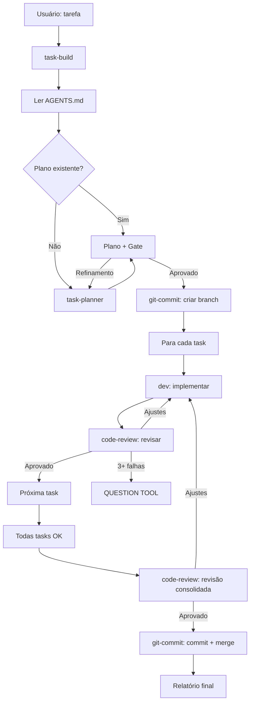

# Orquestração Multi-Agente — Guia Completo

> **Última atualização**: 2026-06-23
> **Versão do sistema**: 5 agentes + 39 skills
> **Complementa**: `AGENTS.md` (overview do repositório)

## 1. Visão Geral

### O que é

Sistema de orquestração multi-agente que usa 5 agentes especializados
para executar um pipeline completo: planejar → implementar → revisar → commitar.

### Quando usar task-build vs. abordagem manual

| Cenário | Abordagem |
|---------|-----------|
| Feature complexa (3+ arquivos) | `task-build` (pipeline completo) |
| Fix pontual (1-2 arquivos) | `dev` + `git-commit` |
| Revisão de código | `code-review` |
| Criar plano antes de implementar | `task-planner` |
| Criar commit | `git-commit` |

### Princípio de triangulação

Cada agente **triangula** três fontes de informação:
- `task-build`: Tarefa × Plano × Entrega
- `task-planner`: Tarefa × Codebase × Skills
- `dev`: Task × Plano × Skills
- `code-review`: Plano × Skills × Código

## 2. Os 5 Agentes

### Tabela Resumo

| Agente | Modo | Skills Obrigatórias | Responsabilidade |
|--------|------|---------------------|------------------|
| `task-build` | **primary** | `executing-plans` | Orquestra pipeline completo |
| `task-planner` | subagent | `spec-driven-development`, `executing-plans` | Cria planos adaptativos |
| `dev` | subagent | `executing-plans`, `systematic-debugging` | Implementa código |
| `code-review` | subagent | `api-security-best-practices`, `staff-engineer-review`, `code-reviewer` | Revisa qualidade |
| `git-commit` | subagent | nenhuma | Opera git |

> **Modo `primary`**: `task-build` é o único agente que aparece no TUI Tab.
> Os outros 4 são invocados apenas via Task tool (subagentes).

> **Nota sobre `git-commit`**: É o único subagent sem acesso a skills
> (`"skill"` não listado no opencode.json). É intencional — não precisa
> de skills para operações git.

### 2.1 task-build (Orquestrador)

**O que faz**: Recebe tarefa do usuário, delega planejamento, criação de branch,
implementação, review e commit para os subagentes.

**O que NÃO faz**:
- Nunca modifica código (delega para `dev`)
- Nunca executa git de escrita (delega para `git-commit`)
- Nunca aprova automaticamente (gate de aprovação obrigatório)
- **SEMPRE lê AGENTS.md** antes de qualquer tarefa para entender convenções e gotchas
- **Guia subagentes** com contexto de AGENTS.md quando delega tarefas

### 2.2 task-planner (Planejador)

**O que faz**: Analisa codebase, gera planos adaptativos salvos em
`.opencode/plans/{timestamp}_{slug}.md`.

**O que NÃO faz**:
- Nunca modifica código
- Nunca faz commit/push/merge

### 2.3 dev (Implementador)

**O que faz**: Implementa código seguindo o plano, roda verificações internas
(build/test/lint auto-detect), marca tasks no backlog.

**O que NÃO faz**:
- Nunca executa comandos git de escrita
- Nunca modifica arquivos fora do escopo da task

### 2.4 code-review (Revisor)

**O que faz**: Revisa diff, roda quality checks (auto-detect para Python/Node/Makefile),
verifica conclusão de TODOs no backlog, compara plano vs. implementação.

**O que NÃO faz**:
- Nunca modifica código
- Nunca faz commit

### 2.5 git-commit (Gestor Git)

**O que faz**: Cria commits semânticos (em inglês), gerencia branches, push, merge,
cleanup de branches stale.

**O que NÃO faz**:
- Nunca modifica código fonte ou testes (`edit: "deny"`, `write: "deny"`)
- Nunca roda quality checks

> **Idioma**: O `git-commit.md` tem frontmatter em inglês porque as
> mensagens de commit devem ser em inglês (convenção `feat:`, `fix:`, etc.).
> O `description` no `opencode.json` está em PT-BR.

## 3. Fluxo de Orquestração

### 3.1 Fluxo Completo (task-build)



### 3.2 Fluxo Simples (sem task-build)

```
1. dev → entender contexto + implementar
2. git-commit → branch + commit + cleanup
```

### 3.3 Fluxo de Revisão

```
1. code-review → analisar mudanças
2. dev → aplicar feedback
3. git-commit → commitar fixes
```

## 4. Configuração do Sistema

### 4.1 Estrutura de Diretórios

```
~/.config/opencode/              ← symlink para opencode_termux/.config/opencode/
├── opencode.jsonc               ← config global
├── package.json                 ← dependências de skills
├── skills/                      ← 39 skills
└── agents/                      ← 5 agentes
    ├── task-build.md
    ├── task-planner.md
    ├── dev.md
    ├── code-review.md
    └── git-commit.md

projeto/
├── opencode.json                ← config do projeto (referencia agents e skills)
├── .opencode/plans/             ← planos gerados pelo task-planner
├── docs/PROJECT_BACKLOG_*.md    ← backlog com checkboxes e timestamps
```

### 4.2 Setup em Device Novo

O symlink `~/.config/opencode/` é criado pelo `scripts/setup.sh`:

```bash
git clone <url> opencode_termux
cd opencode_termux
bash scripts/setup.sh          # cria symlink + instala deps npm
source shell/aliases.sh        # ou adicionar ao ~/.bashrc
cp .env.example .env           # e editar
```

O `setup.sh`:
1. Faz backup de `~/.config/opencode/` existente (se não for symlink)
2. Cria symlink: `~/.config/opencode/` → `opencode_termux/.config/opencode/`
3. Instala dependências npm do `.config/opencode/`

### 4.3 opencode.json — Campos Essenciais

- `skills.paths`: onde buscar skills
- `permission.skill`: quais skills são permitidas
- `agent.<name>.description`: descrição do agente
- `agent.<name>.mode`: `primary` (TUI Tab) ou `subagent` (via Task tool)
- `agent.<name>.prompt`: caminho do arquivo .md do agente (`{file:.config/opencode/agents/<name>.md}`)
- `agent.<name>.permission`: permissões granulares (bash, read, edit, write, question, skill, rbac)

## 5. RBAC e Permissões

### 5.1 O que é RBAC

**RBAC** (Role-Based Access Control) controla quais agentes podem chamar
outros agentes. No OpenCode, é definido na seção `rbac` de cada agente
no `opencode.json`.

### 5.2 Matriz de Permissões

| Agente | bash | read | edit | write | question | skill |
|--------|------|------|------|-------|----------|-------|
| `task-build` | permitido (git deny) | ✅ | ❌ | ❌ | ✅ | ✅ |
| `task-planner` | permitido (git deny) | ✅ | ❌ | ✅ | ✅ | ✅ |
| `dev` | permitido (`git *` deny) | ✅ | ✅ | ✅ | ✅ | ✅ |
| `code-review` | permitido | ✅ | ❌ | ❌ | ✅ | ✅ |
| `git-commit` | permitido (merge/push ask) | ✅ | ❌ | ❌ | ✅ | — |

### 5.3 Regras RBAC (quem pode chamar quem)

```
task-build ──→ task-planner, dev, code-review, git-commit  (pode chamar todos)
task-planner ──→ NÃO pode chamar task-build
dev ──→ NÃO pode chamar task-build
code-review ──→ NÃO pode chamar task-build
git-commit ──→ NÃO pode chamar task-build
```

**Por que `task-build` não tem seção `rbac`?**
Porque é `mode: primary` — é o único agente invocado diretamente pelo
usuário. Os 4 subagentes têm `"rbac": { "task-build": "deny" }` para
impedir chamadas circulares.

### 5.4 Gotchas de Configuração

> ⚠️ **RBAC syntax**: O formato correto é `"agente": "perm"`, não
> `"perm": ["agente"]`. O formato array é inválido e silenciosamente
> ignorado pelo OpenCode.

Exemplo correto:
```json
"rbac": {
  "task-build": "deny"
}
```

Exemplo incorreto (IGNORADO pelo OpenCode):
```json
"rbac": {
  "deny": ["task-build"]
}
```

### 5.5 Permissões Git por Agente

| Agente | git deny | git ask | Pode fazer |
|--------|----------|---------|------------|
| `task-build` | add, commit, push, merge, branch -d/-D, reset, rebase, stash | — | status, log, diff |
| `task-planner` | commit, push, merge, reset, rebase | — | status, log, diff, branch |
| `dev` | `git *` (tudo) | — | nada |
| `code-review` | — | — | status, log, diff |
| `git-commit` | — | merge, push | commit, branch, checkout, branch -d/-D |

## 6. Mecanismos de Robustez

### 6.1 Circuit Breaker

Se 3+ tasks consecutivas receberem veredito "Precisa de ajustes" do code-review:
- Interromper pipeline imediatamente
- QUESTION TOOL: "Revisar abordagem" / "Aprovar com ressalvas" / "Parar build"

### 6.2 State Hashing (Detecção de Loops)

Após cada tentativa de dev + code-review:
1. Gerar hash do output do dev (100 chars do resumo + arquivos alterados)
2. Comparar com hash da tentativa anterior
3. Se idêntico 3 vezes → "Loop detectado" → QUESTION TOOL

### 6.3 Crash Recovery

Se agent crashar (timeout/erro API):
1. Retry 1x automático com o mesmo prompt
2. Se falhar → salvar estado (task_id, tentativa, output parcial)
3. QUESTION TOOL → continuação via task_id em sessão futura

### 6.4 Orçamento Global

- **Máximo**: 20 tentativas totais (soma de tasks × retries)
- Após cada retry, incrementar contador
- Quando atingir 20 → QUESTION TOOL

### 6.5 Timeouts

| Agente | Timeout | Ação |
|--------|---------|------|
| `task-planner` | 5 min | QUESTION TOOL |
| `dev` | 10 min/task | QUESTION TOOL |
| `code-review` | 5 min | QUESTION TOOL |
| `git-commit` | 5 min | Retry 1x → reportar |

## 7. Logging e Auditoria

### 7.1 Structured Logging (JSON)

Cada delegação gera um log JSON:

```json
{
  "timestamp": "2026-06-22T14:30:00Z",
  "agent": "dev",
  "task_id": "1/3",
  "input_summary": "Implementar autenticação JWT",
  "output_summary": "3 arquivos alterados",
  "duration_ms": 15000,
  "status": "ok",
  "trace_id": "build-20260622-001-task-1"
}
```

Campos obrigatórios: `timestamp`, `agent`, `task_id`, `input_summary`,
`output_summary`, `duration_ms`, `status`, `trace_id`.

### 7.2 Audit Trail

Log imutável (append-only) de todas as ações:

```
[2026-06-22T14:30:00Z] task-build → delegou para dev (task 1/3) → ok
[2026-06-22T14:30:15Z] dev → implementou auth JWT → ok (15s)
[2026-06-22T14:30:20Z] code-review → revisou task 1/3 → "Aprovado" (5s)
```

## 8. Templates Prontos

### 8.1 Template opencode.json (mínimo funcional)

```json
{
  "$schema": "https://opencode.ai/config.json",
  "skills": {
    "paths": [".config/opencode/skills"]
  },
  "permission": {
    "skill": {
      "executing-plans": "allow",
      "systematic-debugging": "allow",
      "spec-driven-development": "allow",
      "api-security-best-practices": "allow",
      "staff-engineer-review": "allow",
      "code-reviewer": "allow"
    }
  },
  "agent": {
    "task-build": {
      "description": "Orquestra o fluxo completo de entrega",
      "mode": "primary",
      "prompt": "{file:.config/opencode/agents/task-build.md}",
      "permission": {
        "bash": {
          "*": "allow",
          "git add *": "deny",
          "git commit *": "deny",
          "git push *": "deny",
          "git merge *": "deny",
          "git branch -d*": "deny",
          "git branch -D*": "deny",
          "git reset *": "deny",
          "git rebase *": "deny",
          "git stash *": "deny"
        },
        "read": "allow",
        "glob": "allow",
        "grep": "allow",
        "edit": "deny",
        "write": "deny",
        "question": "allow",
        "skill": "allow",
        "plan_enter": "allow",
        "plan_exit": "allow"
      }
    },
    "task-planner": {
      "description": "Planeja tarefas antes da implementação",
      "mode": "subagent",
      "prompt": "{file:.config/opencode/agents/task-planner.md}",
      "permission": {
        "bash": {
          "*": "allow",
          "git commit *": "deny",
          "git push *": "deny",
          "git merge *": "deny",
          "git reset *": "deny",
          "git rebase *": "deny"
        },
        "read": "allow",
        "glob": "allow",
        "grep": "allow",
        "edit": "deny",
        "write": "allow",
        "question": "allow",
        "skill": "allow",
        "plan_enter": "allow",
        "plan_exit": "allow",
        "rbac": {
          "task-build": "deny"
        }
      }
    },
    "dev": {
      "description": "Implementa código",
      "mode": "subagent",
      "prompt": "{file:.config/opencode/agents/dev.md}",
      "permission": {
        "bash": {
          "*": "allow",
          "git *": "deny"
        },
        "read": "allow",
        "glob": "allow",
        "grep": "allow",
        "edit": "allow",
        "write": "allow",
        "question": "allow",
        "skill": "allow",
        "plan_enter": "allow",
        "plan_exit": "allow",
        "rbac": {
          "task-build": "deny"
        }
      }
    },
    "code-review": {
      "description": "Revisa código pós-implementação",
      "mode": "subagent",
      "prompt": "{file:.config/opencode/agents/code-review.md}",
      "permission": {
        "bash": {
          "*": "allow"
        },
        "read": "allow",
        "glob": "allow",
        "grep": "allow",
        "edit": "deny",
        "write": "deny",
        "question": "allow",
        "skill": "allow",
        "plan_enter": "allow",
        "plan_exit": "allow",
        "rbac": {
          "task-build": "deny"
        }
      }
    },
    "git-commit": {
      "description": "Cria commits semânticos seguindo as convenções do projeto",
      "mode": "subagent",
      "prompt": "{file:.config/opencode/agents/git-commit.md}",
      "permission": {
        "bash": {
          "*": "allow",
          "git merge *": "ask",
          "git push *": "ask",
          "git checkout -b*": "allow",
          "git branch -d*": "allow",
          "git branch -D*": "allow",
          "git checkout main": "allow"
        },
        "read": "allow",
        "glob": "allow",
        "grep": "allow",
        "edit": "deny",
        "write": "deny",
        "question": "allow",
        "plan_enter": "allow",
        "plan_exit": "allow",
        "rbac": {
          "task-build": "deny"
        }
      }
    }
  }
}
```

### 8.2 Template de Agente Subagent

```markdown
---
description: {descrição curta}
mode: subagent
---

# {Nome} Agent

{O que faz}. **Triangula** {A} × {B} × {C}.

## Workflow

### 1. Carregar skills obrigatórias
Sempre carregar: {skill1}, {skill2}.

### 2. Carregar skills dinâmicas (varredura automática)
Listar TODAS as skills instaladas nos diretórios:
- `~/.config/opencode/skills/`
- `.opencode/skills/`

### 3. {Workflow específico}
...

### N. Relatório (português)
```

### 8.3 Template de Plano Simples (1-2 arquivos)

```markdown
# Plano: {tarefa}

## Objetivo
{O que será feito}

## Tasks
- [ ] {task} — Acceptance: {critério} — Verify: {como confirmar}

## Verificação
{Como confirmar que funcionou}
```

### 8.4 Template de Plano Complexo (6+ arquivos)

```markdown
# Plano: {tarefa}

## Objetivo
## Escopo
- Dentro: {o que será feito}
- Fora: {o que NÃO será feito}

## Assumptions
## Dependências
- Pré-requisitos: {o que precisa existir}
- Ordem: {sequência de implementação}

## Tasks
- [ ] {task}
  - Acceptance: {critério}
  - Verify: {como confirmar}
  - Files: {arquivos}
  - Complexidade: {baixa/média/alta}

## Riscos
- {Risco} → {Mitigação}

## Ordem de Implementação
## Verificação Final
```

### 8.5 Template de Backlog

```markdown
# Backlog — {Projeto}

## Fase 1: MVP

- [ ] **TODO-B-01:** Criar estrutura do projeto — Backend
- [ ] **TODO-F-01:** Implementar interface de login — Frontend
- [ ] **TODO-SEC-01:** Configurar autenticação JWT — Segurança

## Fase 2: Features

- [ ] **TODO-UX-01:** Design do dashboard — UX
- [ ] **TODO-I-01:** Integração com API externa — Integração
```

Formato de conclusão:
```
- [x] **TODO-B-01:** Criar estrutura do projeto – Concluído em [23/06/2026:14:30]
```

> **IMPORTANTE**: O timestamp deve ser gerado via `date '+%d/%m/%Y:%H:%M'` —
> nunca digitado manualmente.

## 9. Gotchas e Práticas Recomendadas

### 9.1 Erros Comuns

| Problema | Solução |
|----------|---------|
| RBAC array silenciosamente ignorado | Usar formato `"agente": "perm"` (não array) |
| Agent editando código sendo que shouldn't | Verificar `edit: "deny"` no opencode.json |
| Git commit sem branch feature | task-build cria branch antes do pipeline |
| Review não roda quality checks | code-review auto-detecta stack (Python/Node/Makefile) |
| Plano sem gate de aprovação | QUESTION TOOL obrigatório após plano |
| Timestamp manual errado | Usar `date '+%d/%m/%Y:%H:%M'` — nunca digitar |
| task-build editando código | Nunca — delegar para dev |
| Skills dinâmicas não carregadas | Varredura automática em `~/.config/opencode/skills/` |

### 9.2 Anti-padrões

- ❌ **Pular explore** → implementar sem entender contexto causa erros
- ❌ **Não usar skill** → re-inventar wheel quando skill já resolve
- ❌ **Commitar sem review** → code quality degrada
- ❌ **Assumir flags** → sempre confirmar na doc local antes de modificar scripts
- ❌ **Não verificar versão** → `cloudflared version`, `proot-distro list` contra doc local

### 9.3 Checklist de Setup (Projeto Novo)

- [ ] Criar `opencode.json` a partir do template (8.1)
- [ ] Criar diretório `.config/opencode/agents/`
- [ ] Criar arquivos de agente a partir do template (8.2)
- [ ] Criar symlink `~/.config/opencode/` (via `setup.sh` ou manual)
- [ ] Verificar permissões com `opencode debug agent <name>`
- [ ] Testar pipeline com tarefa simples

### 9.4 task-build nunca edita arquivos

task-build é um orquestrador puro. Mesmo para tarefas de documentação,
task-build delega a edição para `dev`. Se precisar modificar um arquivo
durante o pipeline, delegar: `task(subagent_type="dev", ...)`.

## 10. Referências

### 10.1 Arquivos do Sistema

| Arquivo | Descrição |
|---------|-----------|
| `.config/opencode/agents/task-build.md` | Prompt do orquestrador |
| `.config/opencode/agents/task-planner.md` | Prompt do planejador |
| `.config/opencode/agents/dev.md` | Prompt do implementador |
| `.config/opencode/agents/code-review.md` | Prompt do revisor |
| `.config/opencode/agents/git-commit.md` | Prompt do gestor git |
| `opencode.json` | Config do projeto (permissões, RBAC) |
| `AGENTS.md` | Overview do repositório |

### 10.2 Skills Relevantes

| Skill | Usado por |
|-------|-----------|
| `executing-plans` | task-build, task-planner, dev |
| `systematic-debugging` | dev |
| `spec-driven-development` | task-planner |
| `api-security-best-practices` | code-review |
| `staff-engineer-review` | code-review |
| `code-reviewer` | code-review |

### 10.3 Agentes Built-in do OpenCode

O OpenCode possui agentes built-in que NÃO são configurados via `opencode.json`:
- **`explore`**: Busca rápida de arquivos e código (uso interno do TUI)
- **`compaction`**: Compactação de contexto (uso interno do TUI)

Esses agentes são distintos dos 5 agentes customizados documentados aqui.

### 10.4 Links Externos

- OpenCode Docs: https://opencode.ai
- obra/superpowers: https://github.com/obra/superpowers
