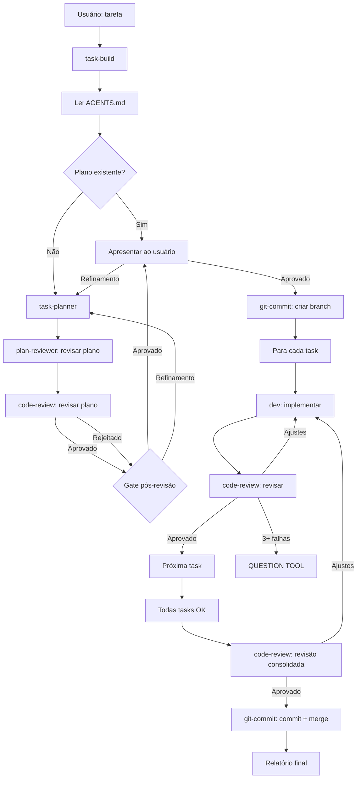

# Orquestração Multi-Agente — Guia Completo

> **Última atualização**: 2026-07-16
> **Versão do sistema**: 5 agentes + 50 skills + OpenCode 1.18.11
> **Complementa**: `AGENTS.md` (overview do repositório)

## 1. Visão Geral

### O que é

Sistema de orquestração multi-agente que usa 5 agentes especializados
para executar um pipeline completo: planejar → implementar → revisar → commitar.

> **IMPORTANTE**: Este arquivo é uma referência GLOBAL. NUNCA copie agentes,
> skills ou este doc para projetos alvo. Os agentes e skills já estão
> disponíveis via symlink `~/.config/opencode/` → `opencode_termux/.config/opencode/`.
> Cada projeto só precisa de `opencode.json` (local) + `AGENTS.md` (convenções).

### Quando usar task-build vs. abordagem manual

| Cenário | Abordagem |
|---------|-----------|
| Feature complexa (3+ arquivos) | `task-build` (pipeline completo) |
| Fix pontual (1-2 arquivos) | `dev` + `git-commit` |
| Revisão de código | `code-review` |
| Criar plano antes de implementar | `task-planner` |
| Criar commit | `git-commit` |

### Princípio de triangulação

Cada agente **triangula** três fontes de informação:
- `task-build`: Tarefa × Plano × Entrega
- `task-planner`: Tarefa × Codebase × Skills
- `dev`: Task × Plano × Skills
- `code-review`: Plano × Skills × Código

## 2. Os 5 Agentes

### Tabela Resumo

| Agente | Modo | Skills Obrigatórias | Responsabilidade |
|--------|------|---------------------|------------------|
| `task-build` | **primary** | `executing-plans` | Orquestra pipeline completo |
| `task-planner` | subagent | `spec-driven-development`, `executing-plans` | Cria planos adaptativos |
| `dev` | subagent | `executing-plans`, `systematic-debugging` | Implementa código |
| `code-review` | subagent | `api-security-best-practices`, `staff-engineer-review`, `code-reviewer`, `agent-restrictions` | Revisa qualidade |
| `git-commit` | subagent | nenhuma | Opera git |

> **Modo `primary`**: `task-build` é o único agente que aparece no TUI Tab.
> Os outros 4 são invocados apenas via Task tool (subagentes).

> **Nota sobre `git-commit`**: É o único subagent sem acesso a skills
> (`"skill"` não listado no opencode.json). É intencional — não precisa
> de skills para operações git.

### 2.1 task-build (Orquestrador)

**O que faz**: Recebe tarefa do usuário, delega planejamento, criação de branch,
implementação, review e commit para os subagentes.

**Responsabilidades**:
- `plan-reviewer` é skill obrigatória — sempre carrega antes de qualquer tarefa
- Code review é obrigatório antes de cada commit (individual + consolidado)
- Revisão consolidada final (step 6e) antes do commit final

**O que NÃO faz**:
- Nunca modifica código (delega para `dev`)
- Nunca executa git de escrita (delega para `git-commit`)
- Nunca aprova automaticamente — revisão do plan-reviewer + gate de aprovação obrigatórios antes de apresentar ao usuário
- **SEMPRE lê AGENTS.md** antes de qualquer tarefa para entender convenções e gotchas
- **Guia subagentes** com contexto de AGENTS.md quando delega tarefas

### 2.2 task-planner (Planejador)

**O que faz**: Analisa codebase, gera planos adaptativos salvos em
`.opencode/plans/{timestamp}_{slug}.md`.

**O que NÃO faz**:
- Nunca modifica código
- Nunca faz commit/push/merge

### 2.3 dev (Implementador)

**O que faz**: Implementa código seguindo o plano, roda verificações internas
(build/test/lint auto-detect), marca tasks no backlog.

**O que NÃO faz**:
- Nunca executa comandos git de escrita
- Nunca modifica arquivos fora do escopo da task

### 2.4 code-review (Revisor)

**O que faz**: Revisa diff, roda quality checks (auto-detect para Python/Node/Makefile),
verifica conclusão de TODOs no backlog, compara plano vs. implementação.

**O que NÃO faz**:
- Nunca modifica código
- Nunca faz commit

### 2.5 git-commit (Gestor Git)

**O que faz**: Cria commits semânticos (em inglês), gerencia branches, push, merge,
cleanup de branches stale.

**O que NÃO faz**:
- Nunca modifica código fonte ou testes (`edit: "deny"`, `write: "deny"`)
- Nunca roda quality checks

> **Idioma**: O `git-commit.md` tem frontmatter em inglês porque as
> mensagens de commit devem ser em inglês (convenção `feat:`, `fix:`, etc.).
> O `description` no frontmatter `.md` está em PT-BR.

## 3. Fluxo de Orquestração

### 3.1 Fluxo Completo (task-build)


```mermaid
graph TD
    A[Usuário: tarefa] --> B[task-build]
    B --> B0[Ler AGENTS.md]
    B0 --> B1{Plano existente?}
    B1 -->|Sim| E[Apresentar ao usuário]
    B1 -->|Não| D[task-planner]
    D --> D2[plan-reviewer: revisar plano]
    D2 --> D3[code-review: revisar plano]
    D3 -->|Aprovado| D4{Gate pós-revisão}
    D3 -->|Rejeitado| D4
    D4 -->|Aprovado| E[Apresentar ao usuário]
    D4 -->|Refinamento| D
    E -->|Aprovado| F[git-commit: criar branch]
    E -->|Refinamento| D
    F --> G[Para cada task]
    G --> H[dev: implementar]
    H --> I[code-review: revisar]
    I -->|Aprovado| J[Próxima task]
    I -->|Ajustes| H
    I -->|3+ falhas| K[QUESTION TOOL]
    J --> L[Todas tasks OK]
    L --> I6e[code-review: revisão consolidada]
    I6e -->|Aprovado| M[git-commit: commit + merge]
    I6e -->|Ajustes| H
    M --> N[Relatório final]
```

### 3.2 Fluxo Simples (sem task-build)

```
1. dev → entender contexto + implementar
2. git-commit → branch + commit + cleanup
```

### 3.3 Fluxo de Revisão

```
1. code-review → analisar mudanças
2. dev → aplicar feedback
3. git-commit → commitar fixes
```

## 4. Configuração do Sistema

### 4.1 Estrutura de Diretórios — Modelo Global + Local

**GLOBAL** (em `opencode_termux/`, acessível via symlink `~/.config/opencode/`):

```
opencode_termux/.config/opencode/
├── opencode.jsonc               ← config global
├── package.json                 ← dependências de skills
├── skills/                      ← 50 skills (composição abaixo)
└── agents/                      ← 5 agentes
    ├── task-build.md
    ├── task-planner.md
    ├── dev.md
    ├── code-review.md
    └── git-commit.md
```

> **Composição das 50 skills**: 27 globais + 14 do
> [obra/superpowers](https://github.com/obra/superpowers): `brainstorming`,
> `dispatching-parallel-agents`, `executing-plans`, `finishing-a-development-branch`,
> `receiving-code-review`, `requesting-code-review`, `subagent-driven-development`,
> `systematic-debugging`, `test-driven-development`, `using-git-worktrees`,
> `using-superpowers`, `verification-before-completion`, `writing-plans`, `writing-skills`.

| Skill | Categoria | Origem | Uso |
|-------|-----------|--------|-----|
| `plan-reviewer` | workflow | global | Revisão de planos antes de implementação |

**LOCAL** (em cada projeto):

```
projeto/
├── opencode.json                ← config do projeto (MÍNIMO: skills.paths + permission.skill)
├── AGENTS.md                    ← convenções específicas do projeto
├── .opencode/plans/             ← planos gerados pelo task-planner
├── docs/PROJECT_BACKLOG_*.md    ← backlog com checkboxes e timestamps
└── README.md
```

### 4.2 Setup em Device Novo

O symlink `~/.config/opencode/` é criado pelo `scripts/setup.sh`:

```bash
git clone <url> opencode_termux
cd opencode_termux
bash scripts/setup.sh          # cria symlink + instala deps npm
source shell/aliases.sh        # ou adicionar ao ~/.bashrc
cp .env.example .env           # e editar
```

O `setup.sh`:
1. Faz backup de `~/.config/opencode/` existente (se não for symlink)
2. Cria symlink: `~/.config/opencode/` → `opencode_termux/.config/opencode/`
3. Instala dependências npm do `.config/opencode/`

### 4.3 opencode.json — Campos Essenciais

- `skills.paths`: onde buscar skills
- `permission.skill`: quais skills são permitidas
- Agentes definidos em markdown em `.config/opencode/agents/` (auto-descobertos)
- Frontmatter YAML: `description`, `mode`, `hidden`, `color`, `temperature`, `permission`
- Permissões no frontmatter: bash (patterns), read, glob, grep, edit, write, question, skill
- NOTA: `permission.task` NÃO funciona no frontmatter .md — ver seção 9.6.3
- `hidden: false` para todos os agentes (visíveis no TUI)
- Cores: task-build=blue, task-planner=green, dev=orange, code-review=purple, git-commit=gray

### 4.4 Arquitetura de Config — Por que Symlink?

O modelo usa um symlink `~/.config/opencode/` → `opencode_termux/.config/opencode/`
para compartilhar agentes e skills entre TODOS os projetos.

**Por que symlink (não cópia)?**
- **Atualização centralizada**: atualizar `opencode_termux` atualiza TODOS os projetos
- **Consistência**: todos os projetos usam as mesmas versões de agents e skills
- **Economia de espaço**: uma única cópia de 50 skills + 5 agents

**O que cada projeto mantém LOCALMENTE:**
- `opencode.json`: permissões e config do projeto (MÍNIMO: skills.paths + permission.skill). Agentes definidos em markdown em `.config/opencode/agents/`.
- `AGENTS.md`: convenções, gotchas, e workflow do projeto
- `.opencode/plans/`: planos de implementação
- `docs/PROJECT_BACKLOG_*.md`: backlog de tasks

> **NUNCA copie** prompts `.md` dos agents ou diretórios de skills para o projeto.
> Eles já estão disponíveis via symlink `~/.config/opencode/`.

### 4.5 Como Adicionar Skills a um Projeto

Quando configurar a orquestração em um projeto novo, siga estes passos para garantir que todas as skills necessárias estejam disponíveis:

#### Passo 1: Ler o diretório de skills disponíveis

```bash
ls ~/.config/opencode/skills/
```

Isso lista todas as 50 skills disponíveis via symlink global.

#### Passo 2: Identificar skills obrigatórias para o projeto

Cada agente tem skills obrigatórias. Verifique quais seu projeto precisa:

| Agente | Skills Obrigatórias |
|--------|---------------------|
| `task-build` | `executing-plans`, `plan-reviewer` |
| `task-planner` | `spec-driven-development`, `executing-plans` |
| `dev` | `executing-plans`, `systematic-debugging` |
| `code-review` | `api-security-best-practices`, `staff-engineer-review`, `code-reviewer`, `agent-restrictions` |

#### Passo 3: Adicionar skills ao opencode.json do projeto

No `opencode.json` do projeto, adicione as skills necessárias na seção `permission.skill`:

```json
{
  "permission": {
    "skill": {
      "executing-plans": "allow",
      "plan-reviewer": "allow",
      "systematic-debugging": "allow",
      "spec-driven-development": "allow",
      "api-security-best-practices": "allow",
      "staff-engineer-review": "allow",
      "code-reviewer": "allow",
      "agent-restrictions": "allow"
    }
  }
}
```

#### Passo 4: Adicionar skills dinâmicas (opcional)

Para projetos que precisam de skills adicionais (ex: `frontend-complete`, `python-pro`, `fastapi-expert`), adicione-as também:

```json
{
  "permission": {
    "skill": {
      "executing-plans": "allow",
      "plan-reviewer": "allow",
      "frontend-complete": "allow",
      "python-pro": "allow"
    }
  }
}
```

#### Passo 5: Verificar skills disponíveis

```bash
# Listar todas as skills
ls ~/.config/opencode/skills/

# Verificar se uma skill específica existe
ls ~/.config/opencode/skills/ | grep -i "frontend"
```

> **IMPORTANTE**: Não copie skills para o projeto. Elas já estão disponíveis
> via symlink `~/.config/opencode/`. Apenas declare-as no `opencode.json`.

## 5. Permissões e permission.task

### 5.1 Controle de delegação entre agentes

O OpenCode 1.18.2 usa `permission.task` para controlar quais subagentes um
agente pode invocar via Task tool. Isso substitui o `rbac` custom usado
anteriormente.

**Formato**:
```yaml
permission:
  task: []  # array vazio = não pode chamar ninguém
```

Regras são avaliadas em ordem; a última regra matching vence.

### 5.2 Quem pode chamar quem

| Agente | `permission.task` | Pode chamar |
|--------|-------------------|-------------|
| `task-build` (primary) | Não definido | Todos os subagentes (padrão) |
| `task-planner` (subagent) | `[]` | Ninguém |
| `dev` (subagent) | `[]` | Ninguém |
| `code-review` (subagent) | `[]` | Ninguém |
| `git-commit` (subagent) | `[]` | Ninguém |

> **⚠️ WARN**: `permission.task` funciona apenas no `opencode.json`, NÃO no frontmatter .md.
> No **OpenCode 1.18.2**, subagentes são isolados por padrão (`subagent_depth=0`) —
> não precisam de `permission.task: []` para não chamarem outros subagentes.
> `permission.task` no JSON ainda funciona para controle granular quando necessário.

### 5.3 Regras de Permissão (quem pode chamar quem)

- agentes `primary` (ex: `task-build`) não precisam de `permission.task` —
  podem chamar todos os subagentes por padrão.
- agentes `subagent` têm `task: []` — não podem chamar ninguém.
- Usuário sempre pode invocar qualquer subagente via `@mention`,
  independente de `permission.task`.

> **⚠️ Nota**: `permission.task` funciona apenas no `opencode.json`, NÃO no frontmatter .md.
> Ver seção 9.6.3 para detalhes.

> **Novo no 1.18.2**: Subagentes não podem mais lançar subagentes aninhados por padrão.
> A configuração `subagent_depth=0` (default) impede que subagentes chamem outros
> subagentes. Para permitir, configure `subagent_depth` no `opencode.json` do projeto.

> **Sintaxe**: `permission.task` aceita um objeto com padrões glob para
> controle granular:
> ```json
> "permission": {
>   "task": {
>     "*": "deny",
>     "code-review": "allow"
>   }
> }
> ```
> No nosso caso, usamos `task: []` (array vazio) para bloquear tudo.

### 5.4 Gotchas

- `permission.task: []` significa "nenhum subagente permitido"
- Se `permission.task` não for definido, o agente pode chamar TODOS
  (padrão para primary agents)
- O `rbac` custom antigo foi removido — usar `permission.task`
- Cores dos agentes no TUI: `task-build`=blue, `task-planner`=green,
  `dev`=orange, `code-review`=purple, `git-commit`=gray

> **⚠️ Nota**: As regras acima valem para `permission.task` em `opencode.json`.
> No frontmatter .md, `permission.task` é ignorado pelo parser do OpenCode 1.18.2 (ver 9.6.3).

## 6. Mecanismos de Robustez

### 6.1 Circuit Breaker

Se 3+ tasks consecutivas receberem veredito "Precisa de ajustes" do code-review:
- Interromper pipeline imediatamente
- QUESTION TOOL: "Revisar abordagem" / "Aprovar com ressalvas" / "Parar build"

### 6.2 State Hashing (Detecção de Loops)

Após cada tentativa de dev + code-review:
1. Gerar hash do output do dev (100 chars do resumo + arquivos alterados)
2. Comparar com hash da tentativa anterior
3. Se idêntico 3 vezes → "Loop detectado" → QUESTION TOOL

### 6.3 Crash Recovery

Se agent crashar (timeout/erro API):
1. Retry 1x automático com o mesmo prompt
2. Se falhar → salvar estado (task_id, tentativa, output parcial)
3. QUESTION TOOL → continuação via task_id em sessão futura

### 6.4 Orçamento Global

- **Máximo**: 20 tentativas totais (soma de tasks × retries)
- Após cada retry, incrementar contador
- Quando atingir 20 → QUESTION TOOL

### 6.5 Timeouts

| Agente | Timeout | Ação |
|--------|---------|------|
| `task-planner` | 5 min | QUESTION TOOL |
| `plan-reviewer` | 3 min | Retry 1x → QUESTION TOOL |
| `dev` | 10 min/task | QUESTION TOOL |
| `code-review (plano)` | 10 min | QUESTION TOOL |
| `code-review (código)` | 5 min | QUESTION TOOL |
| `git-commit` | 5 min | Retry 1x → reportar |

## 7. Logging e Auditoria

### 7.1 Structured Logging (JSON)

Cada delegação gera um log JSON:

```json
{
  "timestamp": "2026-06-22T14:30:00Z",
  "agent": "dev",
  "task_id": "1/3",
  "input_summary": "Implementar autenticação JWT",
  "output_summary": "3 arquivos alterados",
  "duration_ms": 15000,
  "status": "ok",
  "trace_id": "build-20260622-001-task-1"
}
```

Campos obrigatórios: `timestamp`, `agent`, `task_id`, `input_summary`,
`output_summary`, `duration_ms`, `status`, `trace_id`.

### 7.2 Audit Trail

Log imutável (append-only) de todas as ações:

```
[2026-06-22T14:30:00Z] task-build → delegou para dev (task 1/3) → ok
[2026-06-22T14:30:15Z] dev → implementou auth JWT → ok (15s)
[2026-06-22T14:30:20Z] code-review → revisou task 1/3 → "Aprovado" (5s)
```

### 7.3 Quando usar cada formato

| Formato | Quando usar | Uso |
|---------|-------------|-----|
| **Structured Logging (JSON)** | Cada delegação de task-build | Rastreabilidade automatizada, debugging, métricas |
| **Audit Trail** | Visão humana do pipeline | Relatório final, compliance, revisão pós-mortem |
| **Debug (texto simples)** | Step 8 do relatório | Formato compacto para o usuário final |

**Regra**: task-build SEMPRE gera os 3 formatos. Subagentes NÃO geram logs (apenas retornam resultado para task-build logar).

## 8. Templates Prontos

### 8.1 Template opencode.json (mínimo funcional)

```json
{
  "$schema": "https://opencode.ai/config.json",
  "skills": {
    "paths": [".config/opencode/skills"]
  },
  "permission": {
    "skill": {
      "executing-plans": "allow",
      "systematic-debugging": "allow",
      "spec-driven-development": "allow",
      "api-security-best-practices": "allow",
      "staff-engineer-review": "allow",
      "code-reviewer": "allow"
    }
  }
}
```

> **NOTA**: Este é o MÍNIMO necessário. Agentes são resolvidos via symlink global
> `~/.config/opencode/` — NÃO re-declare os 5 agents no `opencode.json` do projeto.
> Se precisar de permissões customizadas de agente, adicione a seção `"agent"` apenas
> para sobrescrever configurações globais.

### 8.2 Template de Agente Subagent

```markdown
---
description: {descrição curta}
mode: subagent
hidden: false
color: {cor}
temperature: 0.2
permission:
  bash:
    "*": allow
    {comandos proibidos}: deny
  read: allow
  edit: deny
  write: deny
  question: allow
  skill: allow
---

> **NOTA**: `permission.task` NÃO é suportado no frontmatter .md — ver seção 9.6.3.

# {Nome} Agent

{O que faz}. **Triangula** {A} × {B} × {C}.

## Workflow

### 1. Carregar skills obrigatórias
Sempre carregar: {skill1}, {skill2}.

### 2. Carregar skills dinâmicas (varredura automática)
Listar TODAS as skills instaladas nos diretórios:
- `~/.config/opencode/skills/`
- `.opencode/skills/`

### 3. {Workflow específico}
...

### N. Relatório (português)
```

### 8.3 Template de Plano Simples (1-2 arquivos)

```markdown
# Plano: {tarefa}

## Objetivo
{O que será feito}

## Tasks
- [ ] {task} — Acceptance: {critério} — Verify: {como confirmar}

## Verificação
{Como confirmar que funcionou}
```

### 8.4 Template de Plano Complexo (6+ arquivos)

```markdown
# Plano: {tarefa}

## Objetivo
## Escopo
- Dentro: {o que será feito}
- Fora: {o que NÃO será feito}

## Assumptions
## Dependências
- Pré-requisitos: {o que precisa existir}
- Ordem: {sequência de implementação}

## Tasks
- [ ] {task}
  - Acceptance: {critério}
  - Verify: {como confirmar}
  - Files: {arquivos}
  - Complexidade: {baixa/média/alta}

## Riscos
- {Risco} → {Mitigação}

## Ordem de Implementação
## Verificação Final
```

### 8.5 Template de Backlog

```markdown
# Backlog — {Projeto}

## Fase 1: MVP

- [ ] **TODO-B-01:** Criar estrutura do projeto — Backend
- [ ] **TODO-F-01:** Implementar interface de login — Frontend
- [ ] **TODO-SEC-01:** Configurar autenticação JWT — Segurança

## Fase 2: Features

- [ ] **TODO-UX-01:** Design do dashboard — UX
- [ ] **TODO-I-01:** Integração com API externa — Integração
```

Formato de conclusão:
```
- [x] **TODO-B-01:** Criar estrutura do projeto – Concluído em [23/06/2026:14:30]
```

> **IMPORTANTE**: O timestamp deve ser gerado via `date '+%d/%m/%Y:%H:%M'` —
> nunca digitado manualmente.

### 8.6 Template de AGENTS.md (para Projetos Alvo)

O template completo para criação de `AGENTS.md` em projetos alvo está disponível em [`docs/AGENTS_TEMPLATE.md`](AGENTS_TEMPLATE.md).

**Resumo do template**:
- Cabeçalho com nome e descrição do projeto
- Estrutura de diretórios do projeto
- Lista de skills e subagentes disponíveis (5 agentes + 50 skills via symlink)
- Convenções do projeto (código, quality checks, commits, testes, branches, backlog)
- Workflow de orquestração (qual agente usar, padrões, regras de delegação)
- Anti-padrões e gotchas específicas do projeto
- Comandos úteis e leitura recomendada

**Uso**: Copie o template para `AGENTS.md` na raiz do projeto e preencha todos os `{PLACEHOLDERS}`. Consulte também `docs/SESSION_CONTEXT_20260618.md` para contexto da sessão de criação.

## 9. Gotchas e Práticas Recomendadas

### 9.1 Erros Comuns

| Problema | Solução |
|----------|---------|
| `rbac` custom removido | `permission.task` funciona apenas no `opencode.json`, NÃO no frontmatter .md — ver seção 9.6.3 |
| Agent editando código sendo que shouldn't | Verificar `edit: "deny"` no frontmatter .md |
| Git commit sem branch feature | task-build cria branch antes do pipeline |
| Review não roda quality checks | code-review auto-detecta stack (Python/Node/Makefile) |
| Plano sem gate de aprovação | plan-reviewer revisa + QUESTION TOOL obrigatório após plano |
| Timestamp manual errado | Usar `date '+%d/%m/%Y:%H:%M'` — nunca digitar |
| task-build editando código | Nunca — delegar para dev |
| Skills dinâmicas não carregadas | Varredura automática em `~/.config/opencode/skills/` |
| Indirect file editing via bash | Usar padrões de negação no frontmatter .md (sed, python -c, etc.) + lista explícita nos prompts |
| YAML frontmatter mal formatado quebra o parser | Ver seção 9.6 — hex colors, `*` alias, `permission.task`, validação, delimitadores |

### 9.2 Anti-padrões

> **Nota**: O template `AGENTS_TEMPLATE.md` referencia esta lista para anti-padrões gerais.
> Projetos individuais podem adicionar anti-padrões específicos no próprio AGENTS.md.

- ❌ **Pular explore** → implementar sem entender contexto causa erros
- ❌ **Não usar skill** → re-inventar wheel quando skill já resolve
- ❌ **Commitar sem review** → code quality degrada
- ❌ **Assumir flags** → sempre confirmar na doc local antes de modificar scripts
- ❌ **Não verificar versão** → `cloudflared version`, `proot-distro list` contra doc local

### 9.3 Checklist de Setup (Projeto Novo)

- [ ] Verificar symlink: `ls -la ~/.config/opencode/` (deve apontar para opencode_termux)
- [ ] Criar `opencode.json` local a partir do template (8.1) — MÍNIMO: skills.paths + permission.skill
- [ ] Criar `AGENTS.md` do projeto a partir do template (8.6) — convenções locais
- [ ] Criar `.opencode/plans/` (opcional, para planos do task-planner)
- [ ] Verificar permissões com `opencode debug agent <name>`
- [ ] Testar pipeline com tarefa simples

### 9.4 task-build nunca edita arquivos

task-build é um orquestrador puro. Mesmo para tarefas de documentação,
task-build delega a edição para `dev`. Se precisar modificar um arquivo
durante o pipeline, delegar: `task(subagent_type="dev", ...)`.

**Isso inclui métodos indiretos**: sed, awk, python -c, node -e, tee, echo redirect, cp, mv, install, patch, git checkout -b*
Todos estão bloqueados por padrões de negação no frontmatter `.md`.

### 9.5 Proibições de Edição Indireta

**Problema**: Instruções de prompt dizendo "NUNCA editar" não são suficientes.
Agentes podem usar métodos alternativos (sed, python -c, tee) para modificar arquivos.

**Solução**: Duas camadas de proteção:

1. **Prompt instructions**: Lista explícita de métodos proibidos nos prompts dos agentes
2. **Permission system**: Padrões de negação no frontmatter `.md` que bloqueiam comandos específicos

**Métodos bloqueados para `task-build` e `task-planner`**:
- `sed` / `awk` — edição via regex em shell
- `python -c` / `python3 -c` — edição via Python inline
- `node -e` — edição via Node.js inline
- `tee` — redirecionamento de saída para arquivos
- `ruby -e` / `perl -e` — edição via outras linguagens inline
- `cp` / `mv` — substituição de arquivos inteiros
- `install` — instalação de pacotes/modificação do filesystem
- `patch` — aplicação de patches
- `git checkout -b*` — criação de branch (delegado para git-commit)

**Exceção**: `task-planner` pode salvar planos em `.opencode/plans/` (via `write: "allow"`).

**Limitação conhecida**: Redirecionamento shell (`echo "content" > file`,
`cat file1 > file2`) é difícil de bloquear via pattern matching no frontmatter .md.
A camada de prompt instructions cobre isso, mas a camada de permissão não.
Agentes ainda podem usar `echo "content" > file` mesmo com deny patterns.

**Verificação**: Usar `opencode debug agent <name>` para verificar permissões aplicadas.

### 9.6 YAML Frontmatter Gotchas

> **Lição aprendida em 15/07/2026**: Edição manual dos frontmatters dos agentes
> causou quebras no OpenCode 1.18.1. Estas são as armadilhas conhecidas.

#### 9.6.1 Hex colors precisam de aspas

| Correto | Incorreto | Problema |
|---------|-----------|----------|
| `color: "#FFA500"` | `color: #FFA500` | `#` é início de comentário YAML — valor fica null |

**Regra**: Qualquer cor hex DEVE estar entre aspas duplas: `color: "#HEXCODE"`.
Cores nomeadas (purple, orange, gray, etc.) não precisam de aspas.

#### 9.6.2 `*` é alias YAML — usar aspas na chave

| Correto | Incorreto | Problema |
|---------|-----------|----------|
| `"*": allow` | `*: allow` | YAML tenta resolver como alias de referência |

**Regra**: Chaves com `*` DEVEM ter aspas: `"*": allow`, `"git *": deny`.

#### 9.6.3 `permission.task` NÃO funciona no frontmatter .md

| Campo | Suportado no frontmatter .md | Suportado no opencode.json |
|-------|:---:|:---:|
| `permission.bash` | ✅ Sim | ✅ Sim |
| `permission.read` | ✅ Sim | ✅ Sim |
| `permission.edit` | ✅ Sim | ✅ Sim |
| `permission.write` | ✅ Sim | ✅ Sim |
| `permission.skill` | ✅ Sim | ✅ Sim |
| `permission.question` | ✅ Sim | ✅ Sim |
| **`permission.task`** | **❌ Não** | **✅ Sim** |

**Problema**: O parser YAML do OpenCode 1.18.2 ignora `task` dentro de `permission:` no frontmatter .md.

**Workaround**: Configurar `permission.task` no `opencode.json` do projeto (seção `"agent"`),
não no frontmatter .md. Ou aceitar que subagentes podem chamar outros subagentes.

> **NOTA para 1.18.2**: Com a atualização para OpenCode 1.18.2, subagentes são
> isolados por padrão (`subagent_depth=0`). O workaround acima é menos crítico
> agora, mas `permission.task` no `opencode.json` ainda funciona para controle
> granular quando necessário.

#### 9.6.4 Validar YAML antes de aplicar

Sempre validar o frontmatter YAML após edição manual:

```bash
# Validar frontmatter de um agente específico
python3 -c "
import yaml
content = open('.config/opencode/agents/arquivo.md').read()
fm = content.split('---')[1]
yaml.safe_load(fm)
print('YAML válido')
"

# Validar TODOS os agentes de uma vez
for f in .config/opencode/agents/*.md; do
  python3 -c "
import yaml
content = open('$f').read()
fm = content.split('---')[1]
yaml.safe_load(fm)
print('$f: OK')
" 2>&1 || echo "$f: FALHA"
done
```

**Alternativa**: `opencode debug agent <nome>` para verificar parsing pelo OpenCode.

#### 9.6.5 Delimitadores `---` no body do markdown

| Correto | Incorreto | Problema |
|---------|-----------|----------|
| `### Seção` | `---` (isolado no body) | Parsers YAML ingênuos interpretam como fim do frontmatter |

**Regra**: O body do markdown NÃO deve conter `---` isolados como separadores de seção.
Usar `###` ou `####` em vez disso. O parser do OpenCode é robusto, mas parsers YAML
genéricos (como `python3 -c "import yaml; ..."`) podem falhar.

## 10. Melhorias Recentes

Melhorias recentes incluem: git delegado, permission.task, quality checks agnósticos, state hashing, circuit breaker, orçamento global, crash recovery, structured logging, audit trail, skills do superpowers, plan-reviewer para revisão de planos, steps 4b/4c (revisão + gate), timeouts padronizados por agente, subagent_depth.

## 11. Referências

### 11.1 Arquivos do Sistema

| Arquivo | Descrição |
|---------|-----------|
| `.config/opencode/agents/task-build.md` | Prompt do orquestrador |
| `.config/opencode/agents/task-planner.md` | Prompt do planejador |
| `.config/opencode/agents/dev.md` | Prompt do implementador |
| `.config/opencode/agents/code-review.md` | Prompt do revisor |
| `.config/opencode/agents/git-commit.md` | Prompt do gestor git |
| `opencode.json` | Config do projeto (permissões) |
| `AGENTS.md` | Overview do repositório |

### 11.2 Skills Relevantes

| Skill | Usado por |
|-------|-----------|
| `executing-plans` | task-build, task-planner, dev |
| `systematic-debugging` | dev |
| `spec-driven-development` | task-planner |
| `plan-reviewer` | task-build (revisão de plano) |
| `api-security-best-practices` | code-review |
| `staff-engineer-review` | code-review |
| `code-reviewer` | code-review |
| `agent-restrictions` | code-review |

### 11.3 Skills de Workflow

Skills que orquestram fluxos de trabalho:

| Skill | Descrição | Uso |
|-------|-----------|-----|
| `executing-plans` | Executa planos existentes | Pipeline de implementação |
| `plan-reviewer` | Revisa planos antes de implementação | Gate de qualidade |
| `spec-driven-development` | Cria specs antes de código | Projetos novos |
| `writing-plans` | Escrita de planos | Planejamento |
| `subagent-driven-development` | Desenvolvimento com subagents | Multi-agent |
| `requesting-code-review` | Solicita review | Pré-merge |
| `receiving-code-review` | Processa feedback de review | Pós-review |
| `finishing-a-development-branch` | Finaliza branch | Pós-implementação |
| `using-git-worktrees` | Isolamento de branch | Desenvolvimento |
| `verification-before-completion` | Verificação pré-commit | Qualidade |

### 11.4 Agentes Built-in do OpenCode 1.18.2

O OpenCode 1.18.2 inclui 5 built-in agents que complementam nossos agentes custom:

| Agente | Tipo | Descrição |
|--------|------|-----------|
| **Build** | primary | Agente padrão com todas as ferramentas habilitadas |
| **Plan** | primary | Análise e planejamento sem modificar código (read-only) |
| **General** | subagent | Propósito geral, full tools (exceto todo). Invocável via `@general` |
| **Explore** | subagent | Fast read-only para explorar codebase. Invocável via `@explore` |
| **Scout** | subagent | Read-only para pesquisa de dependências. Invocável via `@scout` |

Além destes, há 3 hidden system agents de uso interno: **compaction**, **title**, **summary**.

#### Relação com nossos agentes custom

Nossos 5 agentes (`task-build`, `task-planner`, `dev`, `code-review`, `git-commit`) são especializados em orquestração de entrega e **não substituem** os built-ins:

| Built-in | Nosso equivalente? | Uso recomendado |
|----------|-------------------|-----------------|
| **Build** | Parcial (task-build) | Uso geral/build manual. task-build é mais especializado |
| **Plan** | Parcial (task-planner) | Análise ad-hoc rápida. task-planner gera planos SDD estruturados |
| **General** | Não | Tasks complexas autônomas sem orquestração |
| **Explore** | Não | Busca rápida na codebase pelo usuário |
| **Scout** | Não | Pesquisar docs de dependências externas |

> **Recomendação**: Built-ins e custom agents são complementares. Use `@explore` para buscas rápidas, `@general` para tasks autônomas, e nossos agents para pipelines orquestrados.

### 11.5 Links Externos

- OpenCode Docs: https://opencode.ai
- obra/superpowers: https://github.com/obra/superpowers
